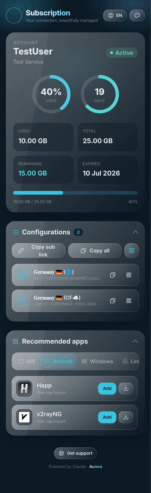

<div align="center">

# 🌌 Aurora

**A premium, single-file subscription page template for the [Rebecca panel](https://github.com/rebeccapanel/Rebecca) (`dev` branch).**

Northern-lights aesthetics · glassmorphism · radial usage rings · one-tap app import · QR codes · EN/FA with full RTL.

Tailwind CSS v4 · DaisyUI v5 · Alpine.js v3 · Phosphor Icons · qrcode-generator

**⚡ Powered by Claude**

</div>

---

## 📸 Preview

<div align="center">



*Screenshot from version **1.2.6**.*

</div>

---

## ✨ Features

- **Service card** — dual progress rings (data usage + time remaining), traffic stats, and expiry. Handles unlimited & never-expire.
- **Configs** — collapsible list with copy, per-config QR, copy-all, and a subscription-link QR.
- **Apps** — collapsible, OS-grouped client list with one-tap import deep links and downloads (from `apps.json`).
- **Themes** — Aurora Dark, Amoled Dark, Aurora Light, Nord (preference persists, storage-optional).
- **i18n** — English / فارسی with full RTL ([Arad](https://github.com/MDarvishi5124/Arad) font, localized digits).
- **Polish** — instant loading splash, lazy-loaded images, and graceful expired/limited/empty states.

Everything ships as **one self-contained `index.html`** (CSS inlined; Alpine + qrcode from pinned CDNs).

---

## 🚀 Installation on Rebecca

In the panel, open **Master Settings → Subscriptions**. The page is loaded from
`{Custom templates directory}/{Subscription page template}` — by default
`/var/lib/rebecca/templates/subscription/index.html`.

Drop the latest build at that path:

```bash
wget -O /var/lib/rebecca/templates/subscription/index.html \
  https://github.com/Ho3einK84/Aurora/releases/latest/download/index.html
```

Make sure **Subscription page template** is set to `subscription/index.html` (the
default). Alternatively, paste the file's contents into the **Template Creator** tab.

That's it. Rebecca re-reads the template on every request, so **no restart is
needed** — just open any user's subscription URL to see it.

### Updating

Re-run the same `wget` command (or re-paste it in **Template Creator**) — the new file is picked up on the next page load.

---

## 🎨 Customization

### Apps list (`src/apps.json`)

Edit `src/apps.json` and rebuild. Schema (mirrors Ourenus):

```json
{
  "name": "Happ",
  "urlScheme": "happ://add/{url}",
  "image": "https://happ.su/img/logo.png",
  "link": "https://happ.su/main/download",
  "os": ["Android", "iOS", "Windows", "Linux"],
  "downloadLinks": { "Android": "https://…", "iOS": "https://…" },
  "ShowInMenu": true
}
```

`{url}` in `urlScheme` is replaced with the URL-encoded subscription URL; set `ShowInMenu: false` to hide an entry.

> **No-rebuild updates:** set `AURORA_APPS_REMOTE_URL` at the top of `src/app.js` to a hosted `apps.json` raw URL. At runtime Aurora fetches it and falls back to the bundled list if the request fails.

### Themes & colors

Themes live in `src/input.css` as DaisyUI `@plugin "daisyui/theme"` blocks (the signature `aurora` / `auroralight` palettes use OKLCH). Add or tweak a theme there, add it to the `themes:` line of `@plugin "daisyui"`, register it in the `AURORA_THEMES` array in `src/app.js`, then rebuild.

### Translations

`AURORA_I18N` in `src/app.js` holds the EN/FA strings — edit or add a language object (include a `dir`).

---

## 🛠 Building locally

```bash
npm ci
npm run build      # → dist/index.html (single self-contained file)
npm run dev        # watch Tailwind during development
```

The build (`scripts/build.mjs`):
1. compiles Tailwind v4 + DaisyUI v5 to minified CSS,
2. inlines the CSS and `app.js` (+ `apps.json` as `window.AURORA_APPS`) into `index.html`,
3. **guarantees every pongo2 `{{ }}` / `` placeholder is preserved byte-for-byte** (the build fails if the count changes).

CI (`.github/workflows/build.yml`) builds on push to `main` and on `v*` tags, and attaches `index.html` to the GitHub Release so `wget …/releases/latest/download/index.html` works.

---

## 🧩 Rebecca template context (reference)

The page binds to the real pongo2 context Rebecca passes (`internal/app/user/subscription.go`):

| Variable | Type | Notes |
|---|---|---|
| `user.username` | string | |
| `user.status` | string | `active` · `limited` · `expired` · `disabled` · `on_hold` |
| `user.status_class` | string | normalized class |
| `user.data_limit` | int64 bytes / falsy | falsy ⇒ unlimited |
| `user.used_traffic` | int64 bytes | |
| `user.expire` | int64 unix / falsy | falsy ⇒ never expires |
| `user.links` / `links` | []string | raw config URIs |
| `user.subscription_url` | string | primary sub URL |
| `usage_url`, `support_url`, `token` | string | |
| `remaining_days` | int64 | precomputed (no `now()` available) |

Filters available: `bytesformat`, `datetime`, `int`.

---

## License

MIT
