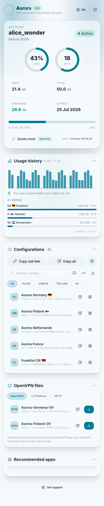

<div align="center">

# 🌌 Aurora

**A premium, single-file subscription page template for the [Rebecca panel](https://github.com/rebeccapanel/Rebecca) (`dev` branch).**

Northern-lights aesthetics · glassmorphism · radial usage rings · usage-history dashboard · one-tap app import · QR codes · EN/FA with full RTL · white-label ready.

Tailwind CSS v4 · DaisyUI v5 · vanilla JS (esbuild) · Phosphor Icons · qrcode-generator

**⚡ Powered by Claude**

</div>

---

## 📸 Preview

<div align="center">



*Version **3.2** — Aurora Light.*

</div>

---

## ✨ Features

- **Service card** — dual progress rings (data usage + time remaining), animated stats, expiry, and a **live quota-reset countdown**. Handles unlimited, never-expire, and `on_hold` accounts; expired/limited states are also derived client-side when the server snapshot is stale.
- **Usage dashboard** — 30-day history chart with 50/80/90 % alerts, a per-server breakdown, a depletion forecast, an offline-cached fallback, and auto-refresh every 5 minutes.
- **Configs** — collapsible list with copy, per-config QR, live search, protocol filter pills, group-by-country, bulk select + copy, and `.txt` export. Full keyboard support.
- **OpenVPN files** (OpenVPN · L2TP/IPsec · PPTP) — a tabbed card for the classic-VPN protocols. `.ovpn` profiles get download/copy-link buttons; L2TP/IPsec and PPTP get credential cards with masked secrets. Fed by the panel's `.ovpn` links and its `/info` endpoint (see "Rebecca template context" below); hidden when the account has no VPN hosts.
- **Apps** — OS-grouped client catalogue with one-tap import deep links, from `src/apps.json`.
- **Themes** — Aurora Dark, Amoled Dark, Aurora Light, Nord. Applied before first paint (no flash), persisted, forceable via `?theme=`.
- **i18n** — English / فارسی with full RTL ([Arad](https://github.com/MDarvishi5124/Arad) font), localized digits, and Jalali dates; forceable via `?lang=fa`.
- **White-label** — brand text driven by the panel's **Subscription profile title** setting, falling back to a legacy binding, then a built-in default — see Customization below.
- **PWA-ready, resilient, accessible** — installable manifest; zero external requests (everything inlined); offline banner and graceful expired/limited/disabled/on-hold/empty states; ARIA labels, focus-trapped QR dialog, `prefers-reduced-motion` respected.

Ships as **one self-contained `index.html`** — no external fonts, CDNs, or runtime network calls (the usage chart and optional remote catalogue talk only to *your* panel/host).

---

## 🚀 Installation on Rebecca

In **Master Settings → Subscriptions**, the page loads from
`{Custom templates directory}/{Subscription page template}` — by default
`/var/lib/rebecca/templates/subscription/index.html`. Drop the latest build there:

```bash
wget -O /var/lib/rebecca/templates/subscription/index.html \
  https://github.com/Ho3einK84/Aurora/releases/latest/download/index.html
```

Make sure **Subscription page template** is set to `subscription/index.html` (the
default), or paste the file's contents into the **Template Creator** tab instead.
Rebecca re-reads the template on every request — **no restart needed**.

To update, just re-run the same `wget` command (or re-paste it).

---

## 🎨 Customization

### White-label / rebranding without a rebuild

Aurora reads the brand text from `subscription_profile_title`, then `brand_name`,
then a built-in default (see the context table below for both bindings — neither
is populated by Rebecca's pongo2 context yet, so today the default applies on
most panels). To rebrand a built file without a rebuild, swap the default in
one line:

```bash
sed -i 's/\bAurora\b/YourBrand/g' /var/lib/rebecca/templates/subscription/index.html
```

This rewrites the whole-word, case-sensitive `Aurora` — `<title>`, splash,
header, and the `<meta name="aurora-brand">` default — while leaving lowercase
internals (`aurora-bg`, `aurora_theme`, …) untouched.

### Apps list (`src/apps.json`)

Edit `src/apps.json` and rebuild — or edit the plain `window.AURORA_APPS = […]`
JSON right inside a built `dist/index.html` (no rebuild needed). Schema:

```json
{
  "name": "Happ",
  "urlScheme": "happ://add/{url}",
  "os": ["Android", "iOS", "Windows", "macOS", "Linux"],
  "link": "https://happ.su/main/download",
  "downloadLinks": { "Android": "https://…", "iOS": "https://…" },
  "ShowInMenu": true
}
```

`urlScheme` placeholders, substituted at runtime:
`{url}` raw subscription URL · `{url_enc}` percent-encoded · `{url_b64}` base64 (Shadowrocket-style) · `{name}` username.

Bundled entries render a theme-aware letter tile; an optional `"image"` URL is
honoured (useful with remote catalogues).

> **No-rebuild updates:** set `AURORA_APPS_REMOTE_URL` at the top of `src/app.js` to a hosted `apps.json` raw URL. At runtime Aurora fetches it and falls back to the bundled list if the request fails.

### Themes & colors

Themes live in `src/input.css` as DaisyUI `@plugin "daisyui/theme"` blocks (OKLCH
palettes). Add or tweak a theme there, add it to the `themes:` line of
`@plugin "daisyui"`, register it in the `THEMES` array in `src/app.js` and the
theme list in the head resolver of `src/index.html`, then rebuild.

### Translations

`src/i18n.js` holds the EN/FA dictionaries — edit or add a language object
(include a `dir`).

---

## 🛠 Building locally

```bash
npm ci
npm run build      # → dist/index.html (single self-contained file)
npm run serve      # preview with sample data on http://localhost:8787
npm run guard      # re-verify the directive guard on an existing build
npm run dev        # watch Tailwind during development
```

The preview server emulates Rebecca's pongo2 rendering with sample data — try
`?state=expired|limited|disabled|on_hold|unlimited|forever|empty`, `?lang=fa`,
`?theme=amoleddark`, `?brand=` / `?title=` (brand bindings), and `INFO=`/`USAGE=`
env vars to exercise the OpenVPN and usage-dashboard fallback paths.

The build (`scripts/build.mjs`) bundles and minifies the app with esbuild, inlines
the compiled CSS/fonts/icons and `apps.json` (zero external requests), base64-encodes
all executable JS so pongo2 never parses it as directives, and **enforces a
directive allow-list** — the build fails on any stray directive, unknown island
binding, or external resource reference. Fonts and libraries are pinned via
`package-lock.json`, so `npm ci && npm run build` is fully reproducible and offline.

CI (`.github/workflows/build.yml`) builds and guards every push/PR, and attaches
`index.html` to the GitHub Release on tags.

---

## 🗂 Project structure

```
aurora/
├── src/
│   ├── index.html      # markup + the pongo2 data-island (the ONLY directives)
│   ├── app.js          # bootstrap, card, rings, countdown, theming, QR modal
│   ├── configs.js      # config parsing, search/filter/group/select, list view
│   ├── vpn.js          # OpenVPN files: .ovpn downloads, L2TP/PPTP credentials (/info)
│   ├── apps.js         # app catalogue, OS detection, import deep links
│   ├── usage.js        # usage dashboard: fetch, cache, chart, forecast
│   ├── i18n.js         # EN/FA dictionaries, digits, dates
│   ├── format.js       # bytes/number parsing + HTML escaping
│   ├── store.js        # preference store (localStorage → cookie → memory)
│   ├── ui.js           # DOM utilities, clipboard, toast, reveal, count-up
│   ├── qr.js           # lazy QR module (SVG renderer)
│   ├── input.css       # Tailwind + DaisyUI themes + Aurora components
│   └── apps.json       # OS-grouped client catalogue
├── assets/fonts/       # Arad woff2 (Inter comes from @fontsource-variable)
├── scripts/
│   ├── build.mjs       # bundle → inline → guard → dist/index.html
│   └── serve.mjs       # local preview with sample pongo2 data (dev only)
└── .github/workflows/build.yml
```

---

## 🧩 Rebecca template context (reference)

The page binds to the real pongo2 context Rebecca passes (`internal/app/user/subscription.go`):

| Variable | Type | Notes |
|---|---|---|
| `user.username` | string | |
| `user.status` | string | `active` · `limited` · `expired` · `disabled` · `on_hold` |
| `user.status_class` | string | normalized class |
| `user.data_limit` | int64 bytes / falsy | falsy ⇒ unlimited |
| `user.data_limit_reset_strategy` | string | `no_reset` · `day` · `week` · `month` · `year` |
| `user.used_traffic` | int64 bytes | |
| `user.expire` | int64 unix / falsy | falsy ⇒ never expires |
| `user.online_count` | int | shown as a presence badge when > 0 |
| `user.service_name` | string | optional service label |
| `user.links` / `links` | []string | raw config URIs — on `dev`, OpenVPN hosts append `https://…/ov/{host_tag}.ovpn` download links |
| `user.subscription_url` | string | primary sub URL |
| `usage_url`, `support_url` | string | usage feeds the dashboard |
| `brand_name` | string | legacy white-label name (optional) |
| `subscription_profile_title` | string | the panel's **Subscription profile title** setting (optional) — not yet populated by Rebecca's pongo2 context; bound proactively for forward compatibility. Takes priority over `brand_name` when present. |
| `remaining_days` | int64 | precomputed fallback (live value derived from `expire`) |

All `now()`-based logic (countdowns, ring depletion, forecasts) runs client-side.

### VPN info endpoint (`dev` branch)

As of `dev` @ `bbb57da`/`4579d6d`, Rebecca's pongo2 context *also* exposes
`openvpn`, `l2tp`, `pptp` (and a combined `vpn`) — the same structures below.
Aurora deliberately does **not** bind these as new template directives: they're
nested arrays of objects, which would need a much larger, harder-to-guard
directive surface than the flat scalar bindings above. Instead Aurora sources
this data from the public subscription info route at runtime
(`{subscription_url}/info`, `internal/app/user/subscription.go → SubscriptionInfo`),
which returns the identical, independently-versioned payload:

```jsonc
{
  "user":    { /* UserDetail */ },
  "openvpn": {
    "downloads": ["https://…/sub/{token}/ov/{host_tag}.ovpn", "…"],
    "profiles":  [ { "host_tag": "…", "inbound_tag": "…", "remark": "…",
                      "filename": "…", "download_url": "…" } ]
  },
  "l2tp": [ { "host_tag": "…", "host_name": "…", "inbound_tag": "…", "remark": "…",
              "server": "…", "address": "…", "port": 1701, "ike_port": 500,
              "natt_port": 4500, "tunnel_port": 1702,
              "username": "…", "password": "…", "ipsec_psk": "…" } ],
  "pptp": [ { "host_tag": "…", "host_name": "…", "inbound_tag": "…", "remark": "…",
              "server": "…", "address": "…", "port": 1723,
              "username": "…", "password": "…" } ]
}
```

`openvpn` was named `ov` on older `dev` builds (pre `4579d6d`) — Aurora reads
either key, so it works against both schemas. `.ovpn` profiles themselves are
served at `GET {sub_path}/{identifier}/ov/{host_tag}.ovpn`
(`application/x-openvpn-profile`). On panels without these routes the fetch
fails silently and the OpenVPN files card simply stays hidden (or shows only
the `.ovpn` links found in `links`), so the template remains fully
backward-compatible.

---

## License

MIT
