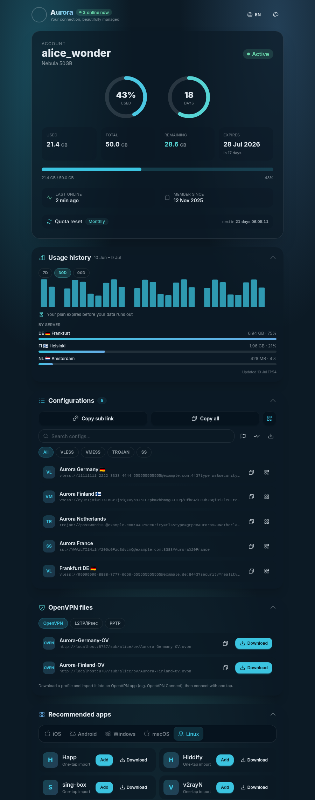

<div align="center">

# 🌌 Aurora

**A premium, single-file subscription page template for the [Rebecca panel](https://github.com/rebeccapanel/Rebecca) (`dev` branch).**

Glassmorphism · usage dashboard · EN/FA RTL · white-label · Tailwind v4 + DaisyUI v5 + vanilla JS

**⚡ Powered by Claude**

</div>

---

## 📸 Preview

<div align="center">



*Version **3.3** — Aurora Light.*

</div>

---

## ✨ Features

- **Service card** — usage/time rings, animated stats, live quota-reset countdown. Handles unlimited, never-expire, `on_hold`, and client-derived expired/limited states.
- **Usage dashboard** — 30-day chart, threshold alerts, per-server breakdown, depletion forecast, offline cache, 5-min auto-refresh.
- **Configs** — search, protocol filters, group-by-country, bulk select + copy, `.txt` export, full keyboard support.
- **OpenVPN files** (OpenVPN · L2TP/IPsec · PPTP) — download/copy `.ovpn` profiles and masked credential cards, fed by the panel's `/info` endpoint (see reference below); hidden without VPN hosts.
- **Apps** — OS-grouped client catalogue with one-tap import, from `src/apps.json`.
- **Themes & i18n** — 4 themes, EN/فارسی with full RTL, forceable via `?theme=`/`?lang=fa`.
- **White-label** — brand text from the panel's Subscription profile title, with fallbacks (see Customization below).
- **PWA-ready, resilient, accessible** — installable manifest, zero external requests, offline/error states, ARIA + keyboard support.

One self-contained `index.html` — no external fonts, CDNs, or runtime calls beyond *your* panel/host.

---

## 🚀 Installation on Rebecca

In **Master Settings → Subscriptions**, drop the latest build at
`/var/lib/rebecca/templates/subscription/index.html` (default path), or paste it into **Template Creator**:

```bash
wget -O /var/lib/rebecca/templates/subscription/index.html \
  https://github.com/Ho3einK84/Aurora/releases/latest/download/index.html
```

Rebecca re-reads the template on every request — no restart needed. Re-run the same command to update.

---

## 🎨 Customization

**White-label** — Aurora reads `subscription_profile_title`, then `brand_name`, then a
built-in default (see reference below). To rebrand a built file in place:

```bash
sed -i 's/\bAurora\b/YourBrand/g' /var/lib/rebecca/templates/subscription/index.html
```

**Apps** (`src/apps.json`) — edit and rebuild, or edit `window.AURORA_APPS` directly
in a built file (no rebuild). Placeholders in `urlScheme`: `{url}` raw ·
`{url_enc}` percent-encoded · `{url_b64}` base64 · `{name}` username.
`AURORA_APPS_REMOTE_URL` in `src/app.js` enables no-rebuild updates from a hosted JSON.

**Themes** — DaisyUI blocks in `src/input.css`; register new ones in `THEMES`
(`src/app.js`) and the head resolver (`src/index.html`).

**Translations** — EN/FA dictionaries in `src/i18n.js`.

---

## 🛠 Building locally

```bash
npm ci
npm run build      # → dist/index.html
npm run serve      # preview at http://localhost:8787
npm run guard      # re-verify the directive guard
npm run dev        # watch Tailwind
```

`serve.mjs` emulates Rebecca's pongo2 rendering (`?state=`, `?lang=fa`, `?theme=`,
`?brand=`/`?title=`). `build.mjs` bundles with esbuild, inlines CSS/fonts/icons/apps.json
(zero external requests), base64-encodes JS so pongo2 never parses it, and **enforces a
directive allow-list** — it fails on any stray directive or external reference.
CI builds and guards every push/PR and attaches `index.html` to Releases on tags.

---

## 🗂 Project structure

```
aurora/
├── src/
│   ├── index.html      # markup + the pongo2 data-island (the ONLY directives)
│   ├── app.js          # bootstrap, card, rings, countdown, theming, QR modal
│   ├── configs.js      # config parsing, search/filter/group/select, list view
│   ├── vpn.js          # OpenVPN files: .ovpn downloads, L2TP/PPTP credentials (/info)
│   ├── apps.js         # app catalogue, OS detection, import deep links
│   ├── usage.js        # usage dashboard: fetch, cache, chart, forecast
│   ├── i18n.js         # EN/FA dictionaries, digits, dates
│   ├── format.js       # bytes/number parsing + HTML escaping
│   ├── store.js        # preference store (localStorage → cookie → memory)
│   ├── ui.js           # DOM utilities, clipboard, toast, reveal, count-up
│   ├── qr.js           # lazy QR module (SVG renderer)
│   ├── input.css       # Tailwind + DaisyUI themes + Aurora components
│   └── apps.json       # OS-grouped client catalogue
├── assets/fonts/       # Arad woff2 (Inter comes from @fontsource-variable)
├── scripts/
│   ├── build.mjs       # bundle → inline → guard → dist/index.html
│   └── serve.mjs       # local preview with sample pongo2 data (dev only)
└── .github/workflows/build.yml
```

---

## 🧩 Rebecca template context (reference)

The page binds to the real pongo2 context Rebecca passes (`internal/app/user/subscription.go`):

| Variable | Type | Notes |
|---|---|---|
| `user.username` | string | |
| `user.status` | string | `active` · `limited` · `expired` · `disabled` · `on_hold` |
| `user.status_class` | string | normalized class |
| `user.data_limit` | int64 bytes / falsy | falsy ⇒ unlimited |
| `user.data_limit_reset_strategy` | string | `no_reset` · `day` · `week` · `month` · `year` |
| `user.used_traffic` | int64 bytes | |
| `user.expire` | int64 unix / falsy | falsy ⇒ never expires |
| `user.online_count` | int | shown as a presence badge when > 0 |
| `user.service_name` | string | optional service label |
| `user.links` / `links` | []string | raw config URIs — on `dev`, OpenVPN hosts append `https://…/ov/{host_tag}.ovpn` download links |
| `user.subscription_url` | string | primary sub URL |
| `usage_url`, `support_url` | string | usage feeds the dashboard |
| `brand_name` | string | legacy white-label name (optional) |
| `subscription_profile_title` | string | the panel's **Subscription profile title** setting (optional) — not yet populated by Rebecca's pongo2 context; bound proactively for forward compatibility. Takes priority over `brand_name` when present. |
| `remaining_days` | int64 | precomputed fallback (live value derived from `expire`) |

All `now()`-based logic (countdowns, ring depletion, forecasts) runs client-side.

### VPN info endpoint (`dev` branch)

As of `dev` @ `bbb57da`/`4579d6d`, Rebecca's pongo2 context *also* exposes
`openvpn`, `l2tp`, `pptp` (and a combined `vpn`) — the same structures below.
Aurora deliberately does **not** bind these as new template directives: they're
nested arrays of objects, which would need a much larger, harder-to-guard
directive surface than the flat scalar bindings above. Instead Aurora sources
this data from the public subscription info route at runtime
(`{subscription_url}/info`, `internal/app/user/subscription.go → SubscriptionInfo`),
which returns the identical, independently-versioned payload:

```jsonc
{
  "user":    { /* UserDetail */ },
  "openvpn": {
    "downloads": ["https://…/sub/{token}/ov/{host_tag}.ovpn", "…"],
    "profiles":  [ { "host_tag": "…", "inbound_tag": "…", "remark": "…",
                      "filename": "…", "download_url": "…" } ]
  },
  "l2tp": [ { "host_tag": "…", "host_name": "…", "inbound_tag": "…", "remark": "…",
              "server": "…", "address": "…", "port": 1701, "ike_port": 500,
              "natt_port": 4500, "tunnel_port": 1702,
              "username": "…", "password": "…", "ipsec_psk": "…" } ],
  "pptp": [ { "host_tag": "…", "host_name": "…", "inbound_tag": "…", "remark": "…",
              "server": "…", "address": "…", "port": 1723,
              "username": "…", "password": "…" } ]
}
```

`openvpn` was named `ov` on older `dev` builds (pre `4579d6d`) — Aurora reads
either key, so it works against both schemas. `.ovpn` profiles themselves are
served at `GET {sub_path}/{identifier}/ov/{host_tag}.ovpn`
(`application/x-openvpn-profile`). On panels without these routes the fetch
fails silently and the OpenVPN files card simply stays hidden (or shows only
the `.ovpn` links found in `links`), so the template remains fully
backward-compatible.

---

## License

MIT
