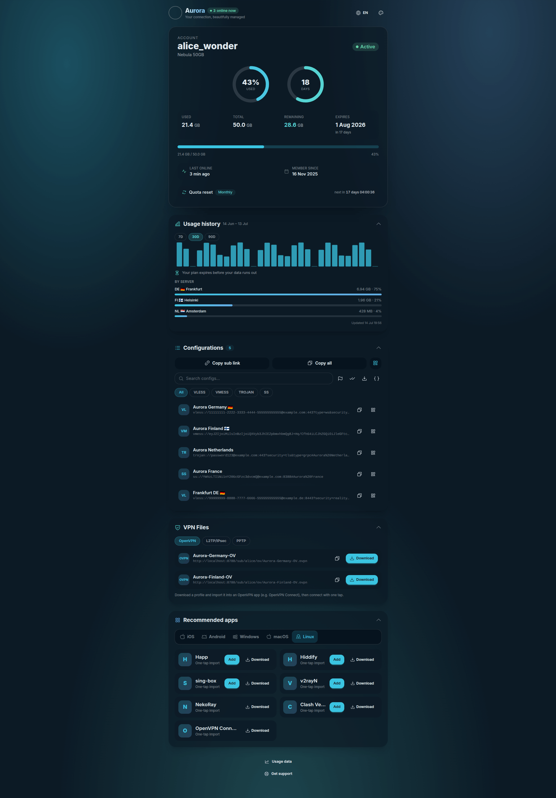

# 🌌 Aurora

**A premium, single-file subscription page template for the [Rebecca panel](https://github.com/rebeccapanel/Rebecca) (`dev` branch).**

Glassmorphism · usage dashboard · EN/FA RTL · white-label · Tailwind v4 + DaisyUI v5 + vanilla JS

---

## 📸 Preview



*Aurora Dark — glassmorphism service card, usage/time rings, config list with protocol filters.*

---

## ✨ Features

- **Service card** — usage/time rings, animated stats, live quota-reset countdown. Handles unlimited, never-expire, `on_hold`, client-derived expired/limited states, and smart low-traffic / low-time renewal alerts.
- **Support & renewal** — top-bar quick support button with intelligent pulsating attention glow (`alert-active`) when subscription expiration is near or traffic is running low.
- **Usage dashboard** — 30-day chart, threshold alerts, per-server breakdown, depletion forecast, offline cache, 5-min auto-refresh. Lazy-loaded via IntersectionObserver.
- **Configs** — search, protocol filters (VMess, VLESS, Trojan, Shadowsocks, Hysteria2, TUIC, SSH, WireGuard, AmneziaWG), group-by-country, bulk select + copy, `.txt`/`.json` export, direct `.conf` download for WireGuard and AmneziaWG, full keyboard support. Web Share API button on mobile.
- **VPN & Remote Access files** (OpenVPN · WireGuard · AmneziaWG · SSTP · GRE · L2TP/IPsec · PPTP · IKEv2 · Cisco AnyConnect) — download/copy `.ovpn` profiles and `.conf` profiles (WireGuard & AmneziaWG) with direct download and quick connect, masked credential cards with MTU/TTL/DNS for SSTP and GRE; Windows `.pbk` (phonebook) generation with one-click connect for PPTP, L2TP, IKEv2, and SSTP (individual and all-in-one download); fed by the panel's `/info` endpoint; IKEv2 and AnyConnect support password and certificate auth. Lazy-loaded.
- **Apps** — OS-grouped client catalogue with one-tap import (from `src/apps.json`), including OpenVPN Connect, OpenVPN GUI, NetMod, WireGuard, Hiddify, Happ, and more.
- **Themes & i18n** — 4 themes, EN/FA/RU/ZH with full RTL, auto OS theme sync. Configurable default language and theme directly in HTML or via `install.sh` without rebuilding.
- **White-label** — brand text from panel profile title with fallbacks, customizable via `brand.json` or interactive installer.
- **PWA-ready & resilient** — self-contained, offline cache, error boundaries, ARIA support.

One self-contained `index.html` — zero external requests at runtime.

---

## 🚀 Installation on Rebecca

### Option 1: Interactive Automatic Installer (Recommended)

Run the one-line installer on your Rebecca server to install, customize brand information, and reload the service automatically:

```bash
curl -fsSL https://raw.githubusercontent.com/Ho3einK84/Aurora/main/install.sh | sudo bash
```

### Option 2: Manual Download

In **Master Settings → Subscriptions**, drop the latest build at
`/var/lib/rebecca/templates/subscription/index.html`:

```bash
wget -O /var/lib/rebecca/templates/subscription/index.html \
  https://github.com/Ho3einK84/Aurora/releases/latest/download/index.html
```

---

## 📡 Shared Hosting Proxy

Extract `hosting.zip` from the latest release to your web root, and set your panel URL in `config.php`:

```php
'panel_url' => 'https://panel.example.com:8443',
```

---

## 🎨 Customization

- **White-label, Default Theme & Language (No Rebuild Needed)**:
  Edit `window.AURORA_BRAND` JSON literal or `<meta>` tags in `dist/index.html`:
  ```html
  <meta name="aurora-default-theme" content="amoleddark" />
  <meta name="aurora-default-lang" content="fa" />
  <script>window.AURORA_BRAND = {"name":"MyVPN","defaultTheme":"amoleddark","defaultLang":"fa"};</script>
  ```
  Or run `install.sh --lang fa --theme amoleddark --brand MyVPN`.
- **Apps**: Edit `window.AURORA_APPS` in `dist/index.html` or `src/apps.json`.

---

## 🛠 Development

```bash
npm ci
npm run build      # → dist/index.html
npm run serve      # preview at http://localhost:8787
npm run guard      # re-verify directive guard
```

---

## 📄 License

MIT
